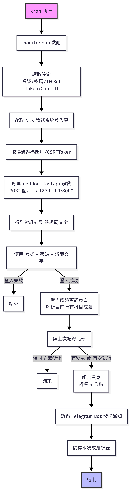

# NUKFinalScoreMonitor
國立高雄大學期末成績監控通知系統

## 自行部署教程
以Linux伺服器為例  
伺服器運行環境：Ubuntu 24.04、Python 3.12、PHP 7.4  
### 一、配置TG BOT
1. 向 @BotFather 發送 /newbot 創建bot，獲取api密鑰  
  
  
2. 向bot發送/start  
  

3. 使用 @GetAnyUserIDBot 或第三方tg客戶端獲取自己TG帳號id

### 二、配置驗證碼自動打碼
1. 安裝 `sudo apt install -y screen python3-venv python3-pip`  
2. 啟用screen `screen -S ddddocr`
3. `git clone https://github.com/JaxxZu/NUKFinalScoreMonitor.git`
4. cd 到 ddddocr-fastapi資料夾 `cd ./ddddocr-fastapi`  
5. 配置虛擬環境 `python3 -m venv ddddocr`  
6. 激活虛擬環境 `source ddddocr/bin/activate`   
7. `pip install -r requirements.txt`  
8. 運行ddddocr自動打碼`python3 -m app.main`

運行後，打碼服務使用8000端口對本機開放

### 三、配置監控主程式
1. 填寫腳本：
```php
$stu_id       = ''; //學號                     
$password     = ''; //選課平台密碼                     
$tg_bot_token = ''; //tg bot api密鑰       
$tg_chat_id   = ''; //TG id(人/頻道/群)           
```   
2. 使用cron定時執行php腳本（每59分鐘檢查一次）  
   `*/59 * * * * /path/to/php /path/to/script`或使用圖形化界面  
  

（可選）查看執行日誌  
  


## 運行結果
腳本首次運行及每次成績變化能取得提醒    
  


## 流程圖



    
本項目使用 [ddddocr-fastapi](https://github.com/sml2h3/ddddocr-fastapi) ，基於 MIT 授權。
